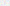

Things helpful for creating SVG jigsaw patterns in the form of 2-dimensional closed-loop pieces (rather than 1-dimensional edge paths).  These are useful for workflows where you are cutting individual pieces.

## Random Generator

### Checkerboard style (example output) [(Go to the generator)](puzzleGenerator2-o.html)

## Handcrafted 2-dimensional patterns (free for use)

### Irregular, 115 pieces with whimsies <a href="irregular-115.svg" download>(Download)</a>

### "Deco" style, 190 pieces <a href="deco-190-pattern.svg" download>(Download)</a>

### "Deco" style, 620 pieces <a href="deco-620-pattern.svg" download>(Download)</a>

## See also

[SVG Warping tool](warp.html)
[Adjusting for kerf in laser-cut jigsaws](https://mchrisman.github.io/zero-kerf-laser-jigsaw/)
