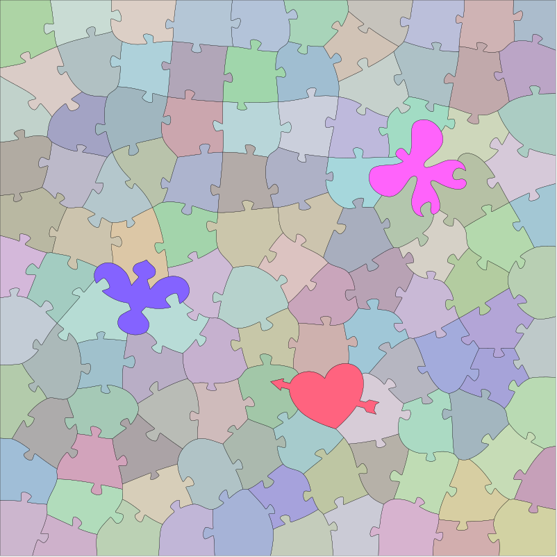
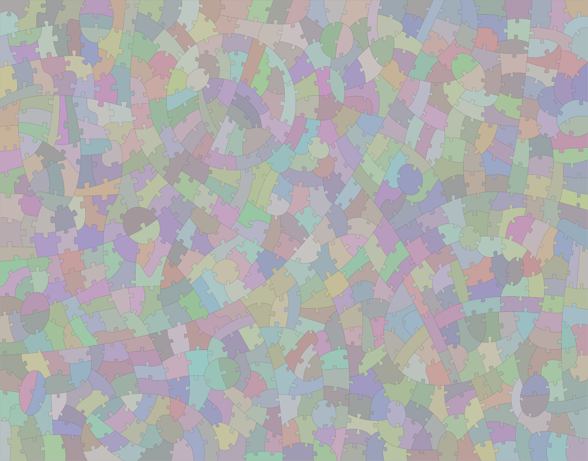

Things helpful for creating SVG jigsaw patterns in the form of 2-dimensional closed-loop pieces (rather than 1-dimensional edge paths).  These are useful for workflows where you are cutting individual pieces.

## Generator

A [SVG jigsaw puzzle pattern generator that can produce solid pieces](puzzleGenerator2-o.html)</a> (i.e. closed outlines) rather than just edges.

## Handcrafted 2-dimensional patterns (free for use)

### Irregular 115 pieces with whimsies <a href="irregular-115.svg" download>(Download)</a>

### "Deco" style, 190 pieces

### "Deco" style, 620 pieces

