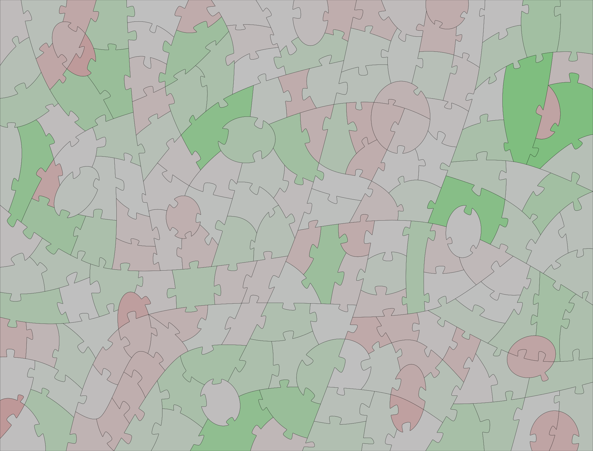

Things helpful for creating SVG jigsaw patterns in the form of 2-dimensional closed-loop pieces (rather than 1-dimensional edge paths).  These are useful for workflows where you are cutting individual pieces.

## Generator

A [SVG jigsaw puzzle pattern generator that can produce solid pieces](puzzleGenerator2-o.html)</a> (i.e. closed outlines) rather than just edges.

## Handcrafted 2-dimensional patterns (free for use)

**To download, right-click and "save":**

### [Irregular 115 pieces with whimsies](irregular-115.svg)

### ["Deco" style, 190 pieces](deco-190-pattern.svg)

### ["Deco" style, 620 pieces](deco-620-pattern.svg)

